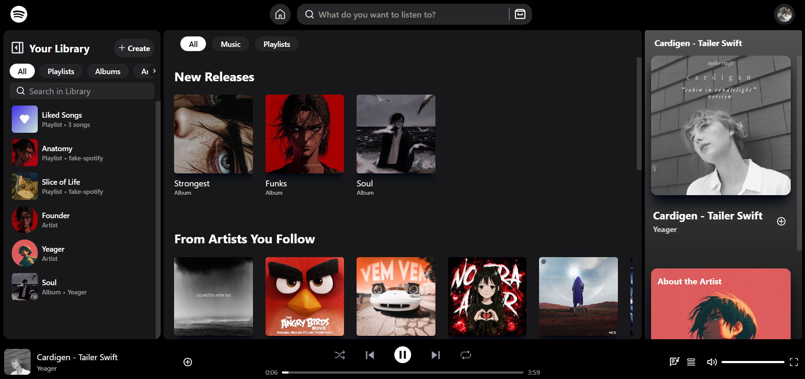
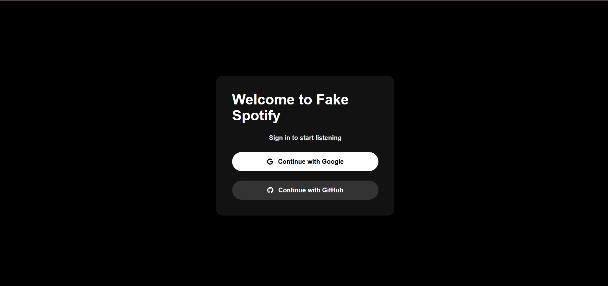
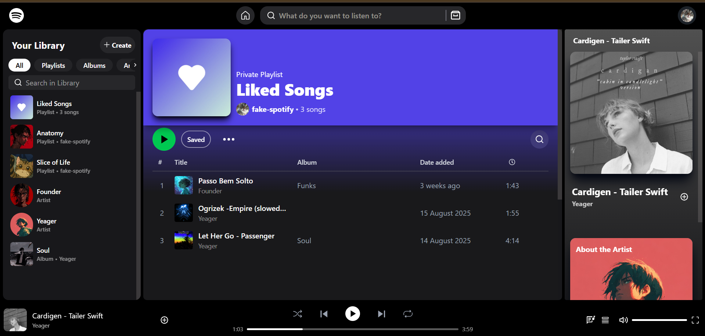
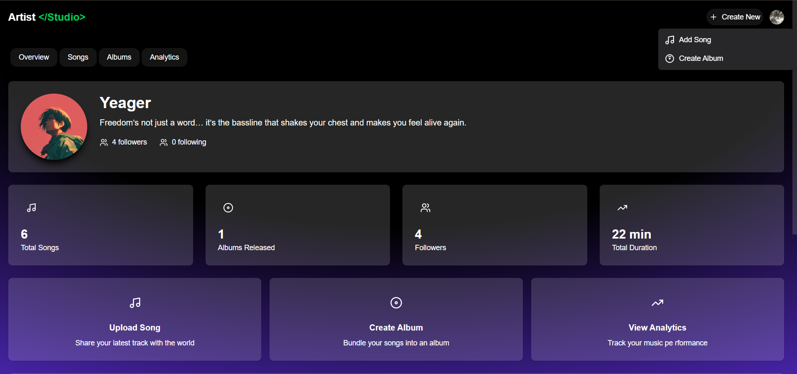
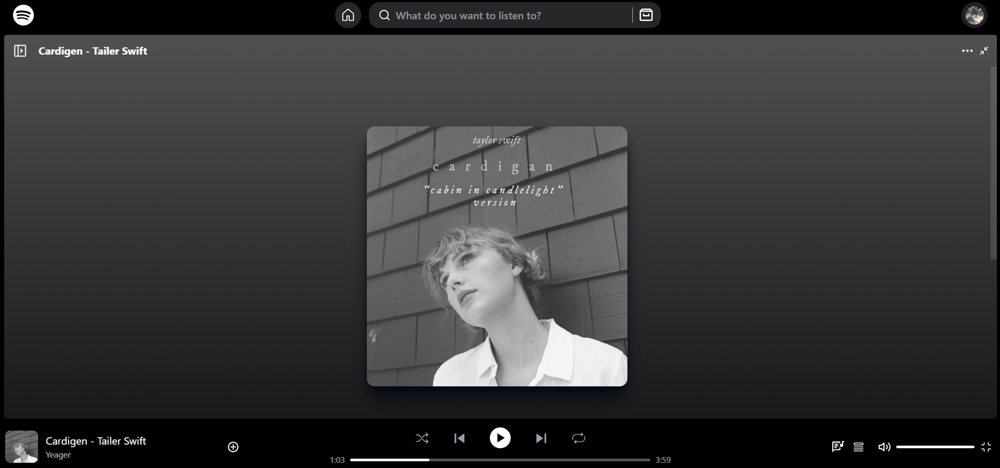
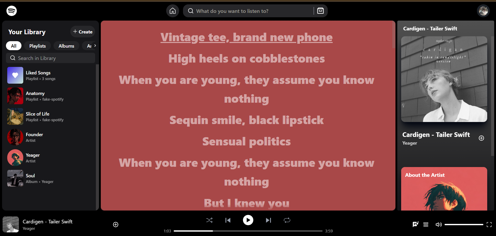
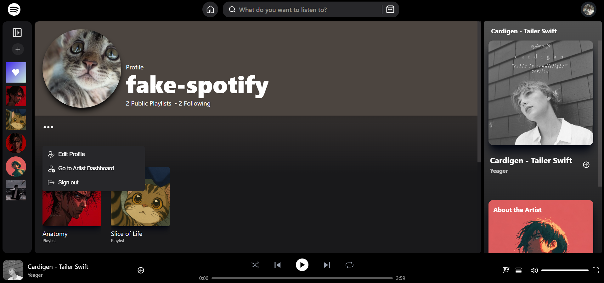

## Fake Spotify (Next.js)

A full‑stack Spotify‑like web app built with Next.js App Router, React, NextAuth, MongoDB (Mongoose), and Cloudinary. It supports authentication, artists and albums, playlists and library, audio playback with queue/shuffle/repeat, synced lyrics, Media Session integration, and basic recommendations/autoplay.



### Tech stack
- **Framework**: Next.js 15 (App Router), React 19
- **Auth**: NextAuth (Google, GitHub providers)
- **DB/ORM**: MongoDB + Mongoose
- **Storage**: Cloudinary (images + audio uploads)
- **UI**: Tailwind CSS 4, lucide-react, react-icons, framer-motion

### Key features
- **Authentication**: Sign in with Google or GitHub. Creates a user profile and an initial "Liked Songs" playlist on first login.

  

- **Library & Playlists**: Save playlists/albums/artists to your library; create and edit playlists.

  

- **Artist mode**: Become an artist, upload songs (image + audio), manage albums/songs. Optional LRC file parsing for synced lyrics.

  

- **Playback**: Player with queue, play next, shuffle, repeat (off/all/one), previous/next, persisted playback state.

  

- **Synced lyrics**: LRC parsing and a high‑performance lyric view with auto‑scroll and click‑to‑seek.

  

- **Recommendations/Autoplay**: After the queue ends, suggests similar songs (by artist, genre, album, or context playlist).
- **Media Session**: Lock‑screen/OS media controls (play/pause/next/previous) with metadata and artwork.

## Getting started

### Prerequisites
- Node.js 18+ and npm
- MongoDB instance (e.g., MongoDB Atlas)
- Cloudinary account (for image/audio uploads)
- OAuth apps for Google and/or GitHub (for NextAuth)

### Installation
```bash
npm install
```

Create a `.env.local` in the project root with the following variables:

```bash
# NextAuth
NEXTAUTH_URL=http://localhost:3000
NEXTAUTH_SECRET=your-strong-random-secret

# OAuth (enable at least one provider)
GOOGLE_CLIENT_ID=...
GOOGLE_CLIENT_SECRET=...
GITHUB_CLIENT_ID=...
GITHUB_CLIENT_SECRET=...

# Database
MONGODB_URI=mongodb+srv://<user>:<pass>@<cluster>/<db>?retryWrites=true&w=majority

# Cloudinary (used for images and audio)
CLOUDINARY_CLOUD_NAME=...
CLOUDINARY_API_KEY=...
CLOUDINARY_API_SECRET=...
```

Run the dev server:
```bash
npm run dev
```
Open `http://localhost:3000`.

## Project structure

```text
src/
  app/
    api/
      auth/[...nextauth]/route.js        # NextAuth providers/callbacks
      become-artist/route.js             # Become/Update artist + image upload
      play/[type]/[id]/route.js          # Build playback context (Song/Album/Artist/Playlist)
      play/song/bulk/route.js            # Resolve song IDs to full records
      recommendations/route.js           # Autoplay/recommendations endpoint
      ... (albums, artists, genres, library, playlists, profile, recents, search, songs)
    (protected)/lyrics/page.jsx          # Synced lyrics view
    layout.js, Providers.jsx             # Global layout + SessionProvider
  Components/
    audioComponents/                     # Player, lyrics, media session
    endbars/, left/, right.jsx           # App shell UI
    Helper/                              # Reusable UI primitives and hooks
  Contexts/                              # Player, library, toast, user, etc.
  lib/                                   # cloudinary, mongoose, SessionWrapper
  models/                                # Mongoose models (User, Artist, Album, Song, Playlist)
  functions/                             # utils (lyricsParser, formatTime, etc.)
  styles/                                # Tailwind styles
```

## Data model overview
- **User** `src/models/User.js`
  - `email`, `name`, `image`, `artist`, `isArtist`
  - `library.playlists|albums|artists` with `added` timestamps
  - `playbackState` persisted structure (currentSong, queue, shuffle, repeat, autoplay)
  - `recents` for songs, albums, playlists, artists
- **Artist** `src/models/Artist.js`
  - `user`, `name`, `image`, `bio`, `albums`, `songs`, `followers/following`
- **Album** `src/models/Album.js`
  - `artist`, `name`, `image`, `description`, `songs`, `releaseDate`
- **Song** `src/models/Song.js`
  - `name`, `genres[]`, `image`, `fileUrl`, `duration`, `artist`, `album`, `views`
  - `lyrics[]` as `{ time: Number (sec), line: String }`
- **Playlist** `src/models/Playlist.js`
  - `type` (Playlist/Liked), `name`, `image`, `description`, `songs[{song, added}]`, `isPublic`, `savedBy[]`

## Core subsystems

### Authentication
- Defined in `src/app/api/auth/[...nextauth]/route.js`.
- On first login, a "Liked Songs" playlist is created and added to the user's library.
- Session strategy: JWT. Ensure `NEXTAUTH_URL` and `NEXTAUTH_SECRET` are set.

### Database & storage
- MongoDB connection in `src/lib/mongoose.js` using `MONGODB_URI`.
- Cloudinary client in `src/lib/cloudinary.js` using `CLOUDINARY_*`.
  - Images upload with `resource_type: "image"`.
  - Audio uploads use `resource_type: "video"` per Cloudinary requirements.

### Playback & queue
- Player state lives in `src/Contexts/playerContext.jsx`.
- Features: original queue + play order, user insert queue, shuffle, repeat(off/all/one), next/prev, persisted state (localStorage, optional server persistence).
- Playback contexts are built by `GET /api/play/[type]/[id]` (Song/Album/Artist/Playlist).

### Synced lyrics
- LRC parsing: `src/functions/lyricsParser.js`.
- UI: `src/Components/audioComponents/syncedLyrics.jsx` with auto‑scroll, binary‑search time sync, click‑to‑seek, and full‑screen mode.

### Recommendations / Autoplay
- Endpoint: `GET /api/recommendations`.
- Seeds: current song, artist, album, and optional playlist context; filters excludes; falls back to top viewed.
- Client triggers this when the queue ends and repeat is off.

### Media Session
- `src/Components/audioComponents/mediaSession.jsx` exposes OS/lock‑screen controls and metadata (title, artist, album, artwork).

## Usage notes

### Becoming an artist and uploading songs
1. Use the UI to become an artist (image upload via Cloudinary).

   

2. After you are an artist, use the dashboard to upload songs:
   - Required fields: `name`, at least one `genre`, `image`, `audioFile`.
   - Optional: `lrcFile` to enable synced lyrics.
   - Audio limit is enforced server‑side (20 MB), but your host/browser may impose lower limits.

### Keyboard and OS controls
- Space toggles play/pause when focus is not in an input.
- Next/Previous/Play/Pause available via OS media controls.

## Environment & deployment
- For local dev set `NEXTAUTH_URL=http://localhost:3000`.
- For deployment, set `NEXTAUTH_URL` to your production URL and configure OAuth callback URLs accordingly.
- Security headers for auth endpoints are added in `next.config.mjs`.

## Common issues & fixes
- **Large audio uploads failing**: Hosts often limit request size. The backend allows ~20 MB, but adjust your hosting limits or compress files.
- **Cloudinary audio not playing**: Ensure uploads use `resource_type: "video"` for audio.
- **Auth callback errors**: Verify `NEXTAUTH_URL`, provider client IDs/secrets, and configured callback URLs in provider dashboards.
- **MongoDB connection errors**: Confirm `MONGODB_URI` and IP allowlist (for Atlas).

## Scripts
```bash
npm run dev    # Start development server
npm run build  # Build for production
npm run start  # Start production server
npm run lint   # Run linting
```

---

If you run into anything unclear, open the relevant file under `src/` (models, contexts, api routes) or ask for guidance.